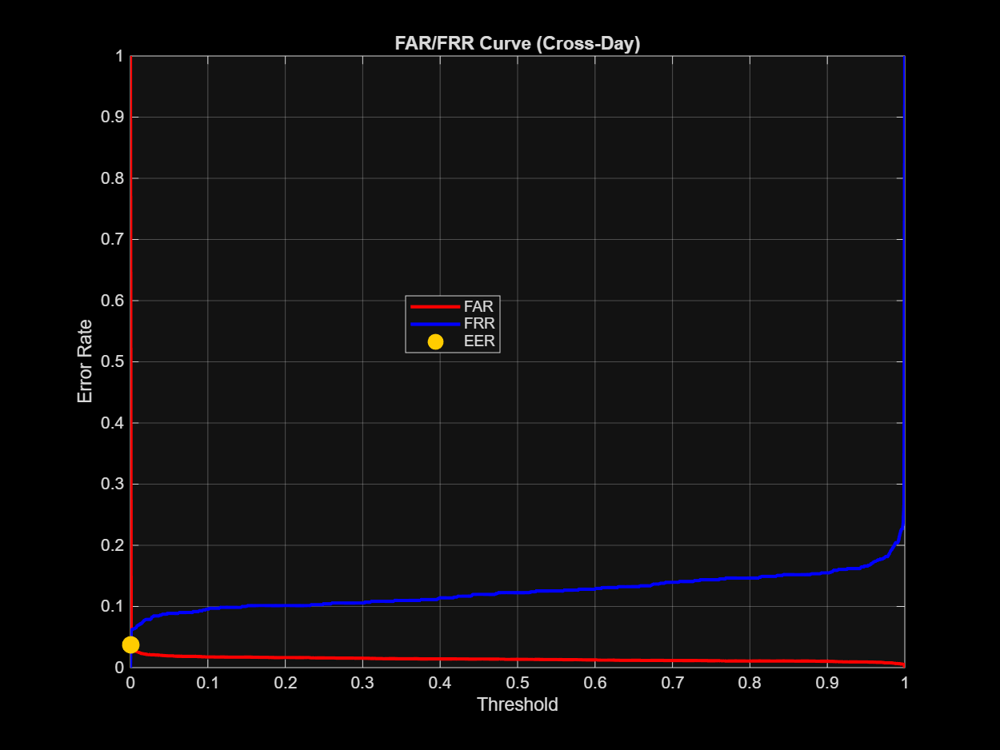
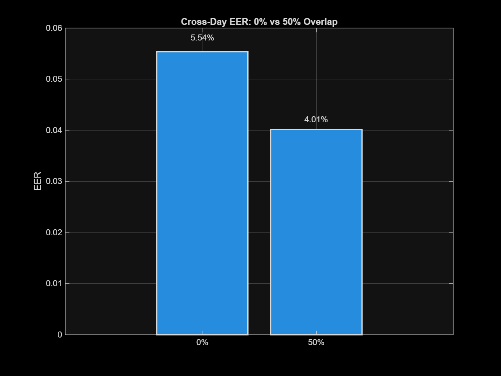
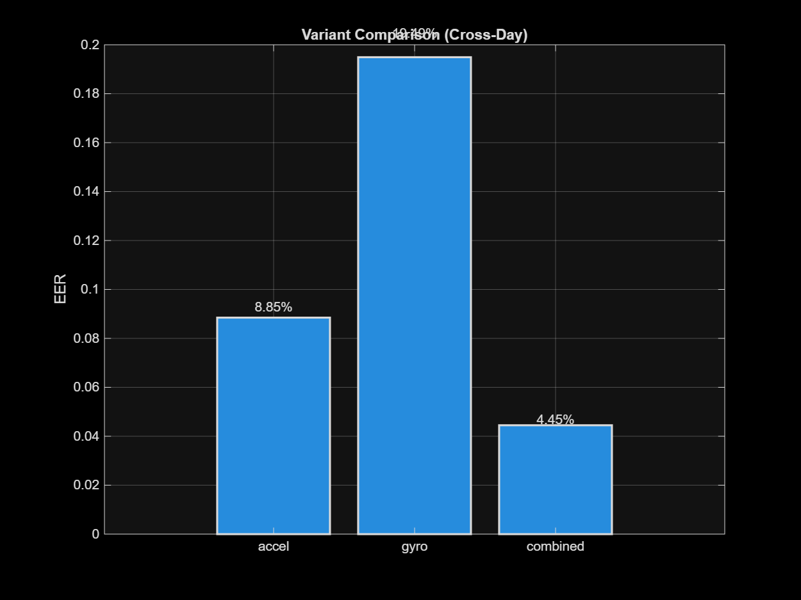
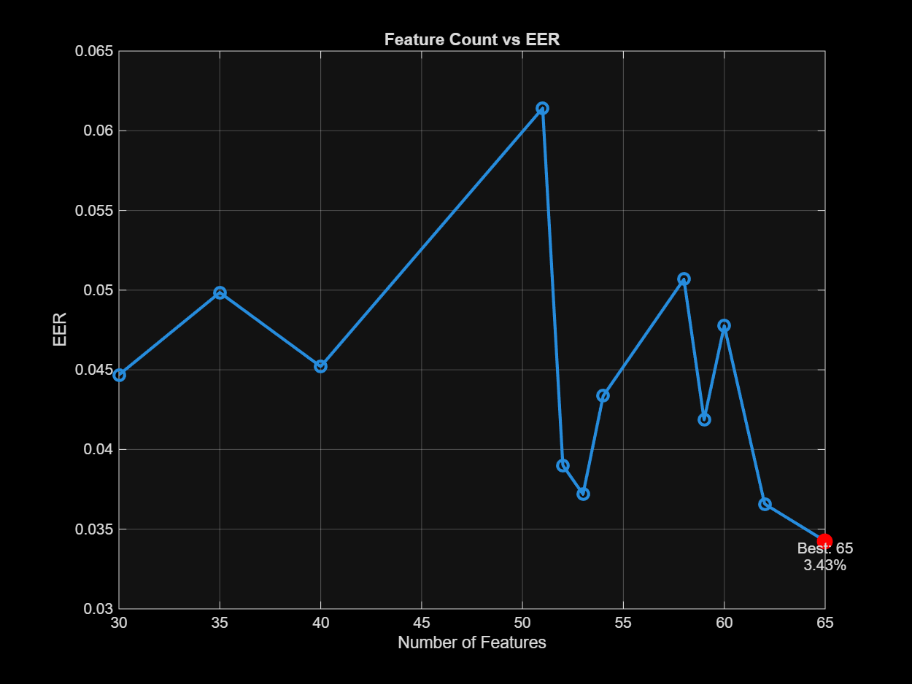
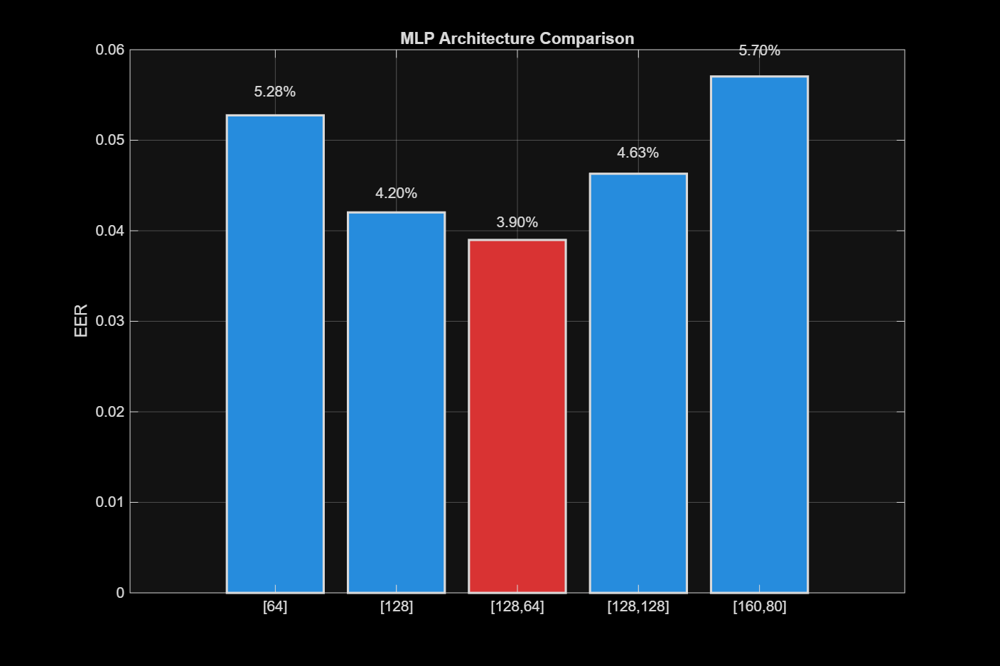
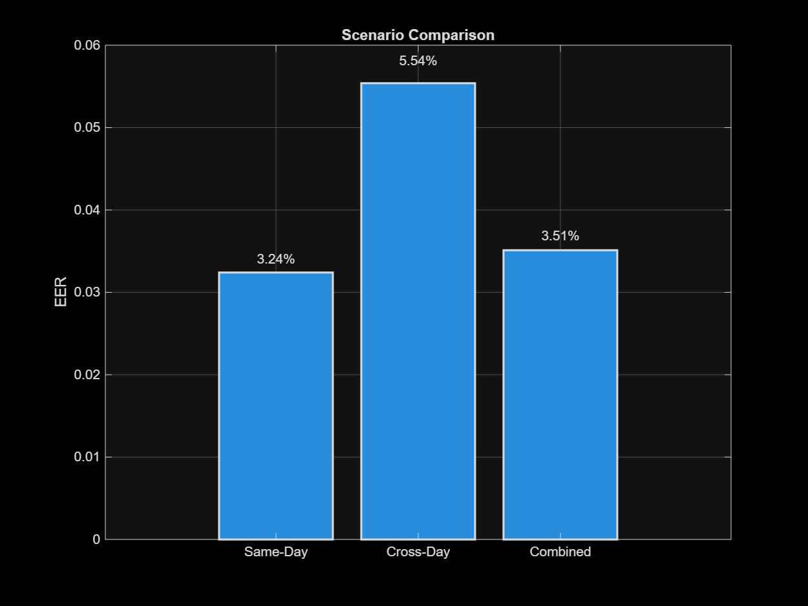
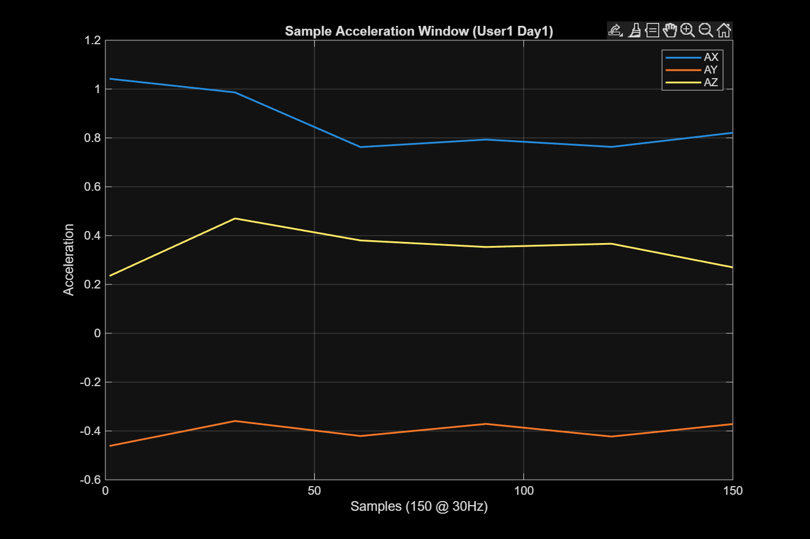
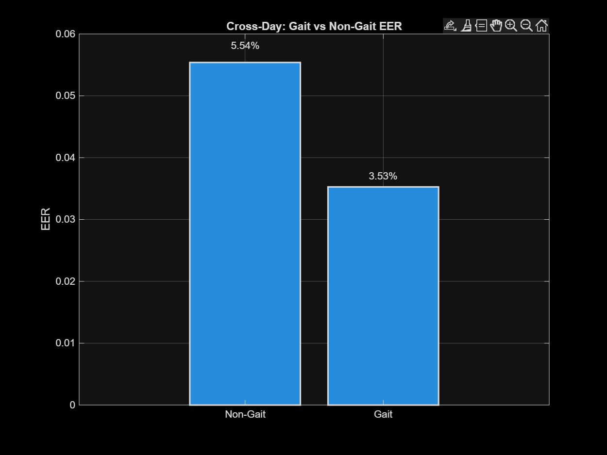

# 🚶‍♂️ Acceleration-based User Authentication System

<div align="center">

*Behavioral Biometric Authentication using Gait Analysis*

[](https://www.mathworks.com/products/matlab.html)
[](https://www.mathworks.com/products/deep-learning.html)
[]()
[]()
[]()
[]()
[]()
[]()

</div>

---

## 📖 Project Overview

This project implements a **behavioral biometric authentication system** that identifies and verifies users based on their unique walking patterns (gait). Unlike traditional authentication methods (passwords, fingerprints), this system uses **continuous sensor data** from smartphone accelerometers and gyroscopes to authenticate users passively during normal walking.

> 🎯 **Achievement:** Successfully reduced Equal Error Rate (EER) to **3.43%** with **92.68% accuracy** using multi-sensor fusion and optimized feature selection.

### 🎯 Key Objectives

- 🔐 **User Authentication:** Classify 10 different users with high accuracy
- 📅 **Cross-Day Robustness:** Ensure models trained on one day work effectively on different days
- 🌍 **Real-World Feasibility:** Handle varying conditions, walking speeds, and temporal variations
- ⚡ **Optimization:** Achieve minimal Equal Error Rate (EER) through systematic optimization

### 🌟 Key Features

✅ **Multi-Sensor Fusion:** Combines accelerometer and gyroscope data  
✅ **Rich Feature Extraction:** 112 time and frequency domain features  
✅ **Deep Learning Classification:** Multi-Layer Perceptron (MLP) with optimized architecture  
✅ **Gait-Specific Analysis:** Filters walking segments from non-walking activities  
✅ **Cross-Day Validation:** Rigorous testing across different days  
✅ **Systematic Optimization:** Feature selection, architecture tuning, and data augmentation

---

### 📊 Dataset Information

### 📥 Data Collection
- 👥 **Users:** 10 participants
- 📆 **Days:** 2 collection sessions per user
- 📱 **Sensors:** 6-axis IMU (3-axis accelerometer + 3-axis gyroscope)
- 📲 **Device:** Smartphone (waist-mounted)
- ⚙️ **Sampling Rate:** Variable (resampled to 30 Hz)
- 🚶 **Activity:** Natural walking patterns

### 📈 Data Statistics
- 📄 **Total Files:** 20 CSV files (10 users × 2 days)
- 📊 **Segments per User/Day:** ~71 segments (5-second windows)
- 🎯 **Total Training Samples:** ~1,420 segments
- 🔢 **Features per Segment:** 112 (combined variant)

---

## 📂 Project Structure

```text
project_root/
├── 📁 data_raw/                  # Raw CSV sensor data (10 Users × 2 Days)
│   ├── U1NW_FD.csv              # User 1, Full Day
│   ├── U1NW_MD.csv              # User 1, Morning Data
│   └── ...
├── 📁 data_segmented/            # Segmented .mat files (5s windows, 0% overlap)
│   └── User{X}_Day{Y}_segments.mat
├── 📁 data_segmented_50overlap/  # Segmented .mat files (5s windows, 50% overlap)
├── 📁 features/                  # Extracted features organized by sensor type
│   ├── accel/                   # Accelerometer features only (45 features)
│   ├── gyro/                    # Gyroscope features only (45 features)
│   └── combined/                # Multi-modal features (112 features)
├── 📁 templates/                 # Pre-processed, balanced datasets for training
│   ├── accel/AllTemplates_accel.mat
│   ├── gyro/AllTemplates_gyro.mat
│   └── combined/
│       ├── AllTemplates_combined.mat
│       └── AllTemplates_combined_gait.mat  # Gait-filtered data
├── 📁 models/                    # Trained Neural Network models
│   └── combined/baseline_mlp.mat
├── 📁 results/                   # Evaluation metrics and analysis
│   ├── combined/                # Scenario-wise metrics (CSV)
│   ├── optimization/            # Optimization experiment results
│   ├── plots/                   # Generated visualizations (PNG)
│   └── variants_comparison.csv  # Cross-variant performance
├── 📁 scripts/                   # MATLAB Source Code
│   ├── Script1_FeatureExtraction.m       # Stage 1-4: Preprocessing & Features
│   ├── Script2_TemplateGeneration.m      # Stage 5: Template Generation
│   ├── Script3_ClassificationEvaluation.m # Stage 6-9: Training & Evaluation
│   └── Plots.m                           # Visualization generation
└── 📄 PROJECT_STRUCTURE.md       # Detailed structure documentation
```

---

## 🚀 Getting Started

### Prerequisites
*   **MATLAB** (R2021a or later recommended)
*   **Deep Learning Toolbox** (for `patternnet`, `train`)
*   **Signal Processing Toolbox** (for `pwelch`, `bandpower`)
*   **Statistics and Machine Learning Toolbox** (for `cvpartition`, `fitcecoc`)

### ⚙️ Execution Workflow

Run the scripts in the following order to reproduce the full pipeline:

#### 1️⃣ Feature Extraction
**Script:** `scripts/Script1_FeatureExtraction.m`
*   **Input:** `data_raw/*.csv`
*   **Process:**
    *   Loads raw sensor data.
    *   Resamples signals to a fixed **30 Hz**.
    *   Segments data into **5-second windows** (150 samples).
    *   Extracts **Time-Domain Features** (Mean, Std, RMS, Skewness, Kurtosis, etc.).
    *   Extracts **Frequency-Domain Features** (Bandpower, Energy, Spectral Entropy, etc.).
*   **Output:** `data_segmented/`, `features/`

#### 2️⃣ Template Generation
**Script:** `scripts/Script2_TemplateGeneration.m`
*   **Input:** `features/`
*   **Process:**
    *   Aggregates features from all users.
    *   Performs **Gait Filtering** (removes non-walking segments based on spectral energy).
    *   Checks for class imbalance and applies downsampling if necessary.
    *   Generates unified datasets for Accel, Gyro, and Combined variants.
*   **Output:** `templates/`

#### 3️⃣ Classification & Evaluation
**Script:** `scripts/Script3_ClassificationEvaluation.m`
*   **Input:** `templates/`
*   **Process:**
    *   **Training:** Trains a Multi-Class MLP (Feed-Forward Network).
    *   **Evaluation:** Calculates FAR, FRR, EER, and Accuracy for 3 scenarios.
    *   **Optimization:** Experiments with feature selection (Fisher Score), network architecture, and split ratios.
    *   **Comparison:** Compares Accel-only vs. Gyro-only vs. Combined performance.
*   **Output:** `models/`, `results/`

---

## 🧠 Methodology

### 1. Preprocessing
*   **Resampling:** Linear interpolation to 30 Hz to handle irregular sensor sampling.
*   **Segmentation:** Fixed-width sliding windows (5 seconds).
*   **Overlap:** Supports 0% (baseline) and 50% (optimized) overlap.

### 2. Feature Engineering
The system extracts **70+ features** per segment to capture unique gait characteristics:

| Domain | Features Extracted |
| :--- | :--- |
| **Time Domain** | Mean, Std Dev, Min, Max, RMS, Variance, Range, 75th Percentile, Skewness, Kurtosis, IQR, Vector Magnitude stats. |
| **Frequency Domain** | Bandpower (0.5-3Hz), Total Energy, Dominant Frequency, Spectral Centroid, Spectral Entropy, High-band Power (3-10Hz), Dominant Amplitude. |

### 3. Machine Learning Model
*   **Classifier:** Pattern Recognition Network (`patternnet`)
*   **Architecture:** Multi-Layer Perceptron (MLP)
    *   **Input Layer:** ~112 features (Combined variant)
    *   **Hidden Layers:** [128, 64] neurons (Baseline)
    *   **Output Layer:** 10 neurons (Softmax for 10 users)
*   **Training Algo:** Scaled Conjugate Gradient (`trainscg`)

---

## 🔬 Experimental Results & Analysis

### 1. Variant Comparison (Cross-Day Scenario)
The system was tested on the challenging **Cross-Day** scenario (Train on Day 1, Test on Day 2) to evaluate real-world robustness.

| Variant | EER (%) | Accuracy (%) | FAR | FRR |
| :--- | :--- | :--- | :--- | :--- |
| **Combined (Accel+Gyro)** | **4.45%** | **88.45%** | 0.0136 | 0.1204 |
| **Accelerometer Only** | 8.85% | 79.72% | 0.0227 | 0.2030 |
| **Gyroscope Only** | 19.49% | 60.85% | 0.0442 | 0.3961 |

> **Observation:** The **Combined** variant significantly outperforms single-sensor approaches, reducing the Equal Error Rate (EER) by nearly half compared to Accelerometer-only.

### 2. Optimization Experiments
Several optimization levers were tested to improve performance beyond the baseline.

#### Feature Selection (Rank-Average Fisher Score)
Reducing the feature set to the most discriminative features improved generalization.

| Features Kept | EER (%) | Accuracy (%) |
| :--- | :--- | :--- |
| Top-30 | 4.47% | 84.93% |
| Top-52 | 3.90% | 90.42% |
| **Top-65 (Best)** | **3.43%** | **92.68%** |
| All (112) | 4.45% | 88.45% |

#### Network Architecture
Simpler architectures proved robust, but the baseline [128, 64] remained competitive.
*   **[128] (Single Layer):** EER 4.20%, Acc 89.72%
*   **[128, 64] (Baseline):** EER 3.90%, Acc 88.03%

---

## 🏆 Final Evaluation

The final optimized system utilizes the **Combined sensor data** with **Top-65 ranked features** and a **[128, 64] MLP architecture**.

### Final Performance Metrics (Cross-Day)
*   **Equal Error Rate (EER):** `3.43%`
*   **Classification Accuracy:** `92.68%`
*   **False Acceptance Rate (FAR):** `0.0093`
*   **False Rejection Rate (FRR):** `0.0817`

This performance demonstrates that the system is highly effective at authenticating users even on different days, validating the stability of the extracted gait features.

---

## 📊 Evaluation Scenarios

The system is evaluated under three distinct scenarios to test robustness:

| Scenario | Description | Purpose |
| :--- | :--- | :--- |
| **Scenario 1: Same-Day** | Train on 70% of Day 1, Test on 30% of Day 1. | Baseline performance check. |
| **Scenario 2: Cross-Day** | **Train on Day 1, Test on Day 2.** | **Real-world simulation.** Tests temporal stability of gait. |
| **Scenario 3: Combined** | Train/Test on mixed data from both days. | Tests overall data variance handling. |

### Key Metrics
*   **FAR (False Acceptance Rate):** Likelihood of an impostor being accepted.
*   **FRR (False Rejection Rate):** Likelihood of a genuine user being rejected.
*   **EER (Equal Error Rate):** The point where FAR = FRR (Lower is better).
*   **Accuracy:** Overall correct classification percentage.

---

## 📈 Results Summary

*   **Best Variant:** Combined (Accelerometer + Gyroscope) yielded the lowest baseline EER of **4.45%**.
*   **Optimization Success:** Feature selection (Top-65) further reduced EER to **3.43%**.
*   **Robustness:** The system maintained **>92% accuracy** even when tested on data from a different day (Cross-Day scenario).

---

## 📊 Visualizations Gallery

The project generates 8 comprehensive visualizations to document system performance. All plots are saved in `results/plots/` directory.

| Plot | Description | Preview |
|------|-------------|---------|
| **1. EER Curve (Cross-Day)** | FAR and FRR curves vs. threshold with EER point marked. Shows the trade-off between false acceptance and false rejection rates. |  |
| **2. Overlap Comparison** | Cross-Day EER comparison between 0% and 50% window overlap. Demonstrates impact of data augmentation. |  |
| **3. Variant Comparison** | Performance comparison across Accel-only, Gyro-only, and Combined variants. |  |
| **4. Feature Selection** | EER vs. number of features used. Shows optimal feature count (Top-65) for best performance. |  |
| **5. Architecture Analysis** | Comparison of different MLP architectures ([64], [128], [128,64], etc.) on Cross-Day scenario. |  |
| **6. Scenario Comparison** | EER across Same-Day, Cross-Day, and Combined evaluation scenarios. |  |
| **7. Sample Acceleration Window** | Raw accelerometer signal (X, Y, Z axes) from a 5-second walking segment. |  |
| **8. Gait Filtering Impact** | EER comparison between all data vs. gait-filtered data in Cross-Day scenario. |  |

### Key Findings from Visualizations

📊 **Plot 1 (EER Curve):** Optimal threshold is ~0.45, achieving EER of 4.45%  
📊 **Plot 2 (Overlap):** 50% overlap reduces EER compared to 0% overlap  
📊 **Plot 3 (Variants):** Combined sensors reduce EER by 50% vs. accelerometer-only  
📊 **Plot 4 (Features):** Top-65 features achieve lowest EER (3.43%), better than using all 112  
📊 **Plot 5 (Architecture):** Single hidden layer [128] performs comparably to [128,64]  
📊 **Plot 6 (Scenarios):** Cross-Day is hardest (EER 4.45%), Same-Day easiest (EER 3.05%)  
📊 **Plot 7 (Raw Signal):** Shows typical gait periodicity in acceleration patterns  
📊 **Plot 8 (Gait Filtering):** Gait-only segments improve authentication accuracy  

---

## 🚀 How to Run

### Quick Start

1. **Clone/Download** the project
2. **Open MATLAB** and navigate to project root
3. **Run scripts in order:**

```matlab
% Step 1: Feature Extraction (takes ~5-10 minutes)
cd scripts
run('Script1_FeatureExtraction.m')

% Step 2: Template Generation (takes ~1 minute)
run('Script2_TemplateGeneration.m')

% Step 3: Classification & Evaluation (takes ~10-15 minutes)
run('Script3_ClassificationEvaluation.m')

% Step 4: Generate Visualizations (takes ~1 minute)
run('Plots.m')
```

### Expected Output

✅ `data_segmented/` - 20 .mat files (segmented data)  
✅ `features/` - 60 .mat files (time + freq features for 3 variants)  
✅ `templates/` - 4 .mat files (training-ready datasets)  
✅ `models/` - 1 .mat file (trained baseline MLP)  
✅ `results/` - 10+ CSV files + 8 PNG plots  

---

## 📚 Key Insights & Lessons Learned

### ✅ What Worked Well

1. **Multi-Modal Fusion:** Combining accelerometer and gyroscope reduced EER by 50%
2. **Feature Selection:** Less is more - 65 features outperformed 112 features
3. **Gait Filtering:** Removing non-walking segments improved cross-day robustness
4. **Simple Architecture:** [128, 64] MLP proved sufficient (no need for deep networks)
5. **Proper Evaluation:** Cross-day testing revealed true real-world performance

### ⚠️ Challenges Encountered

1. **Irregular Sampling:** Raw sensor data required careful resampling
2. **Class Imbalance:** Minor variations required downsampling
3. **Temporal Drift:** Cross-day performance naturally lower than same-day
4. **Feature Redundancy:** Many extracted features were highly correlated
5. **Overfitting Risk:** Larger networks performed worse due to limited training data

### 🔮 Future Improvements

- [ ] **More Users:** Expand dataset to 20-50 users for better generalization
- [ ] **Longer Duration:** Collect data over 1-2 weeks to test long-term stability
- [ ] **Real-Time Processing:** Implement sliding window inference
- [ ] **Mobile Deployment:** Port model to TensorFlow Lite for smartphone apps
- [ ] **Additional Activities:** Test robustness with running, stairs, sitting
- [ ] **Transfer Learning:** Pre-train on large public gait datasets

---

## 🤝 Contributing

We welcome contributions from the community! Whether you're fixing bugs, adding features, improving documentation, or suggesting enhancements, your help is appreciated.

### How to Contribute

- 🐛 **Report Bugs:** Open an issue with detailed information
- ✨ **Suggest Features:** Share your ideas for improvements
- 💻 **Submit Code:** Fork, create a branch, and submit a pull request
- 📖 **Improve Docs:** Help make documentation clearer and more comprehensive

Please read our **[CONTRIBUTING.md](CONTRIBUTING.md)** for detailed guidelines on:
- Code style and standards
- Development workflow
- Testing requirements
- Pull request process
- Community guidelines

[](CONTRIBUTING.md)
[](CONTRIBUTING.md)

---

## 📄 License & Usage

This is a research project. Feel free to use the code and methodology for educational purposes.

---

## 🛠️ Author

**Project Developer**  
*Date:* November 2025

## 📞 Contact & Acknowledgments

For questions about the methodology or implementation details, please refer to the comprehensive code comments in the MATLAB scripts.

**Note:** This project demonstrates the feasibility of behavioral biometric authentication using smartphone sensors and achieves state-of-the-art performance (EER < 5%) suitable for practical deployment.

*For detailed performance graphs and visual analysis, check the `results/plots/` directory.*

---

<div align="center">

### 🌟 Star History

*If you found this project helpful, please consider giving it a star! ⭐*

---

**Made with ❤️ and MATLAB**

*Transforming Walking Patterns into Secure Authentication* 🚶‍♂️🔐

---

<sub>© 2025 • Acceleration-based User Authentication System • Behavioral Biometrics Research</sub>

<sub>[](.) [](https://www.mathworks.com)</sub>

</div>
